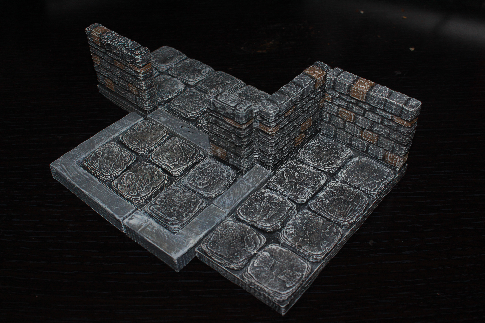

Edge wall tiles
===========

These strips are designed to let tiles with walls along their edge (instead of on top of a square) to be able to but up against each other.  You only need these buffers if you are using the OpenForge edge series.  

There are three basic sets here:  

* Lines  
The lines are the same length as the squares (1x-4x) of the squares on the tiles.  
* corners  
The corners are the same length as the squares (1x-4x) of teh squares on the tiles  plus a hub that's wth width of a wall from a wall tile.  They can have 1-4 spokes coming off that hub.  For most people anything past 3x length with 3 or more spokes is unprintably large.  
* corner walls  
Corner walls are the same as corners, except they also have a wall height spoke going up.  These are designed to fill in gaps between walls butted up against each other.  In most cases, only 1 or 2 spokes are actually useful, but all are uploaded for completeness.  

Stone
-----

You can find this set on [thingivese](http://www.thingiverse.com/thing:204659)

