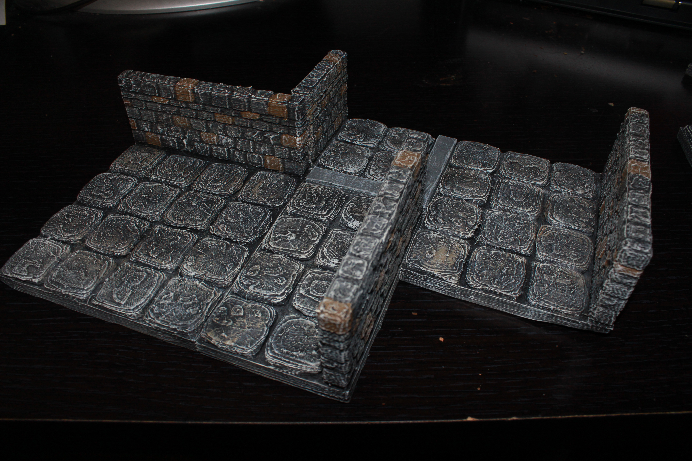
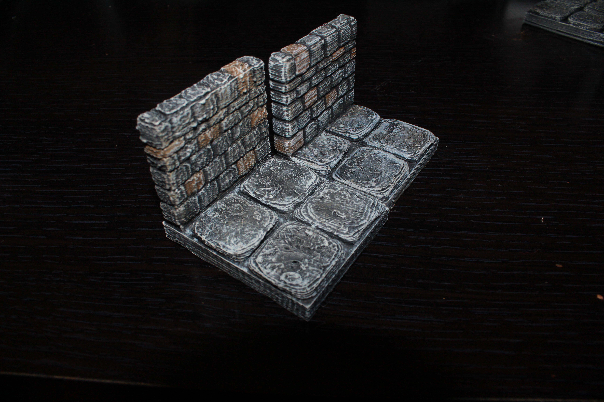
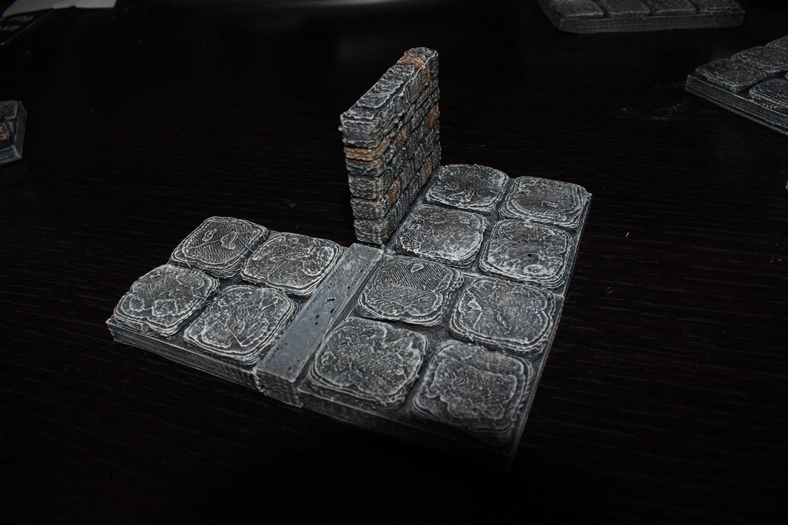
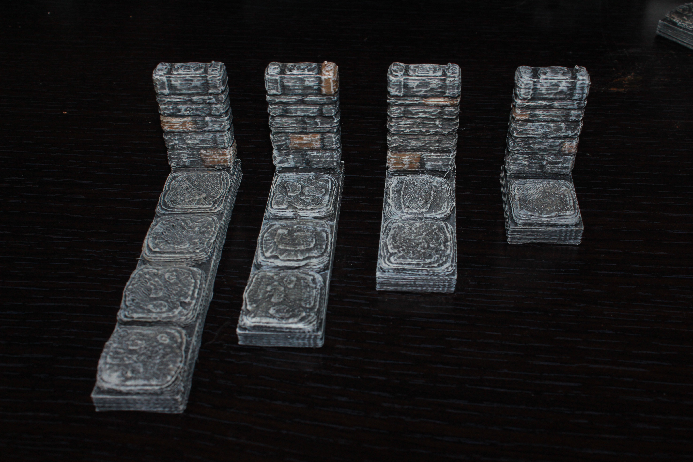
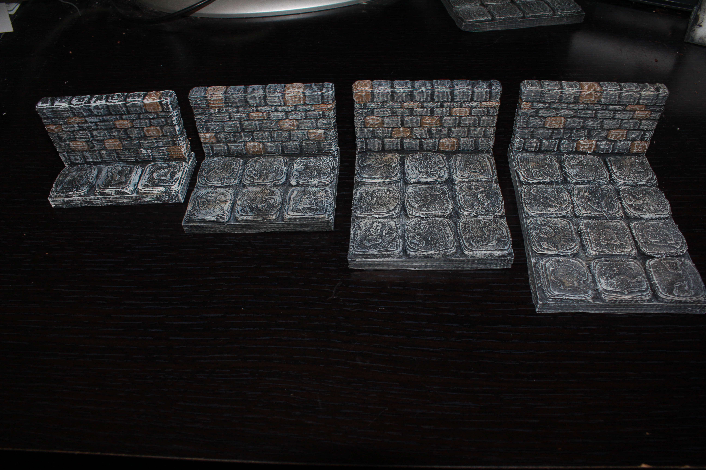

Edge wall tiles
===========

Dungeon edge wall tiles designed to be compatible with Dwarven Forge dungeon tiles.

These tiles are designed to line their wall up with walls from tiles butted up against their neighbors.  These are designed to be used on the edge of the map to give more usable space for the play area, particularly for 1x hallways which would be impossible to fit mins in unless the wall was moved.  Because the wall now takes up some space, you will need to use [edge buffers](../edge_buffer) in some places to get the tiles to lay out properly.

Stone
-----

Currently there are 16 stone wall tiles in every size from 1x1 to 4x4.

<table>
<tr><td><a href="edge_wall_1x1.stl">1x1</a></td><td><a href="edge_wall_1x2.stl">1x2</a></td><td><a href="edge_wall_1x3.stl">1x3</a></td><td><a href="edge_wall_1x4.stl">1x4</a></td></tr>
<tr><td><a href="edge_wall_2x1.stl">2x1</a></td><td><a href="edge_wall_2x2.stl">2x2</a></td><td><a href="edge_wall_2x3.stl">2x3</a></td><td><a href="edge_wall_2x4.stl">2x4</a></td></tr>
<tr><td><a href="edge_wall_3x1.stl">3x1</a></td><td><a href="edge_wall_3x2.stl">3x2</a></td><td><a href="edge_wall_3x3.stl">3x3</a></td><td><a href="edge_wall_3x4.stl">3x4</a></td></tr>
<tr><td><a href="edge_wall_4x1.stl">4x1</a></td><td><a href="edge_wall_4x2.stl">4x2</a></td><td><a href="edge_wall_4x3.stl">4x3</a></td><td><a href="edge_wall_4x4.stl">4x4</a></td></tr>
</table>

You can find this set on [thingivese](http://www.thingiverse.com/thing:178621)

