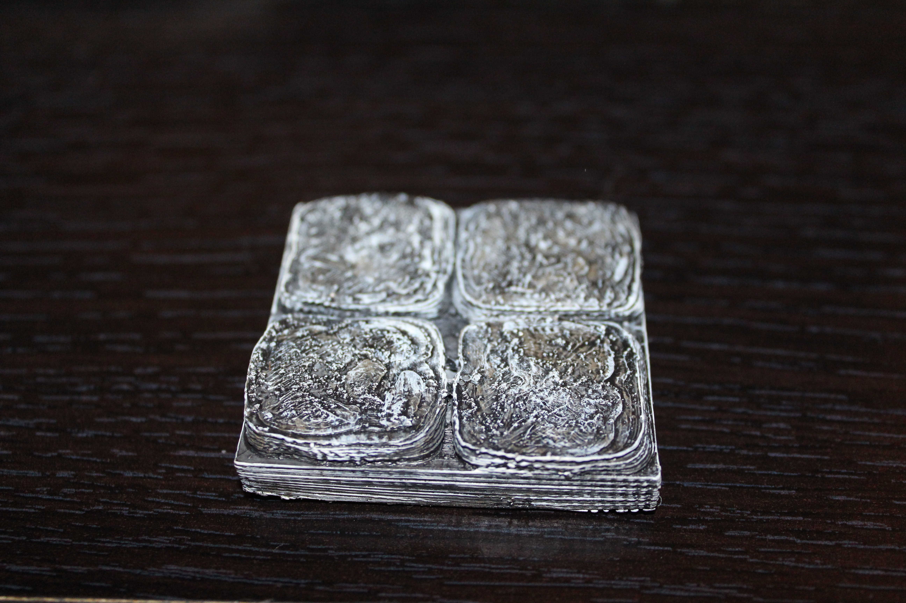
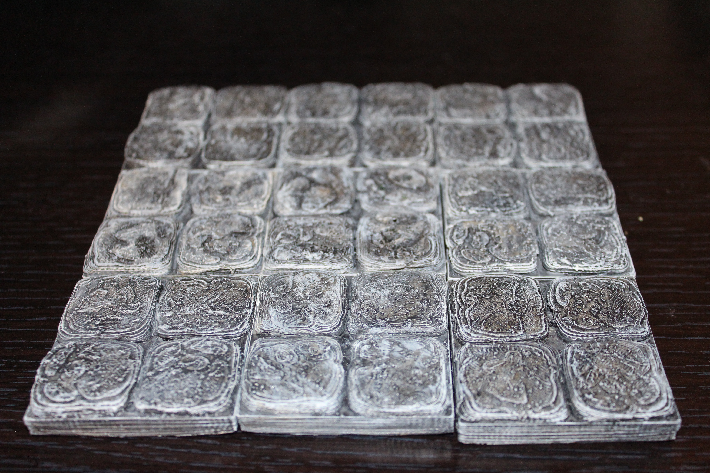

Floor tiles
===========

Dungeon floor tiles designed to be compatible with Dwarven Forge dungeon tiles.

Stone
-----

Currently there are 16 stone floor tiles in every size from 1x1 to 4x4.

Note:  I've included two orientations for any non square tile.  This is to make
scripting in the rest of the package easier.  I'm well aware that you could
 just turn the 1x2 tile 90 degrees to become 2x1.

<table>
<tr><td>[1x1](stone_floor_1x1.stl)</td><td>[1x2](stone_floor_1x2.stl)</td><td>[1x3](stone_floor_1x3.stl)</td><td>[1x4](stone_floor_1x4.stl)</td></tr>
<tr><td>[2x1](stone_floor_2x1.stl)</td><td>[2x2](stone_floor_2x2.stl)</td><td>[2x3](stone_floor_2x3.stl)</td><td>[2x4](stone_floor_2x4.stl)</td></tr>
<tr><td>[3x1](stone_floor_3x1.stl)</td><td>[3x2](stone_floor_3x2.stl)</td><td>[3x3](stone_floor_3x3.stl)</td><td>[3x4](stone_floor_3x4.stl)</td></tr>
<tr><td>[4x1](stone_floor_4x1.stl)</td><td>[4x2](stone_floor_4x2.stl)</td><td>[4x3](stone_floor_4x3.stl)</td><td>[4x4](stone_floor_4x4.stl)</td></tr>
</table>

You can find this set on [thingivese](http://www.thingiverse.com/thing:171315)

Updates
-------

* 1.0.1 : increased floor tile height by 500 microns to be as close to even as possible with Dwarven Forge tiles.
* 1.0.2 : Added substantially more flooring faces which allowed the creation of 1x1 - 4x4

