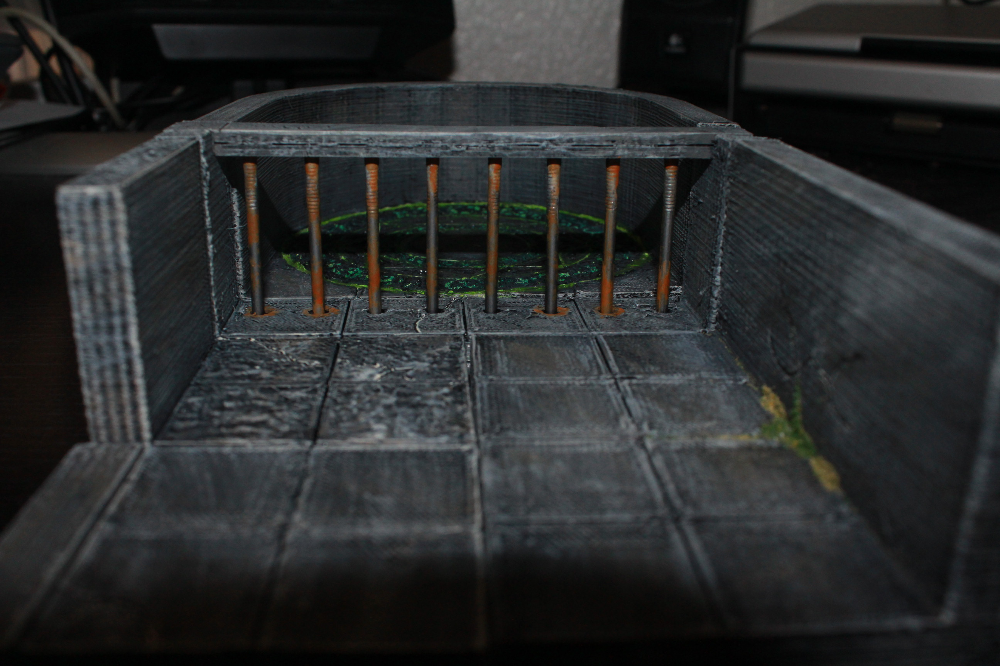
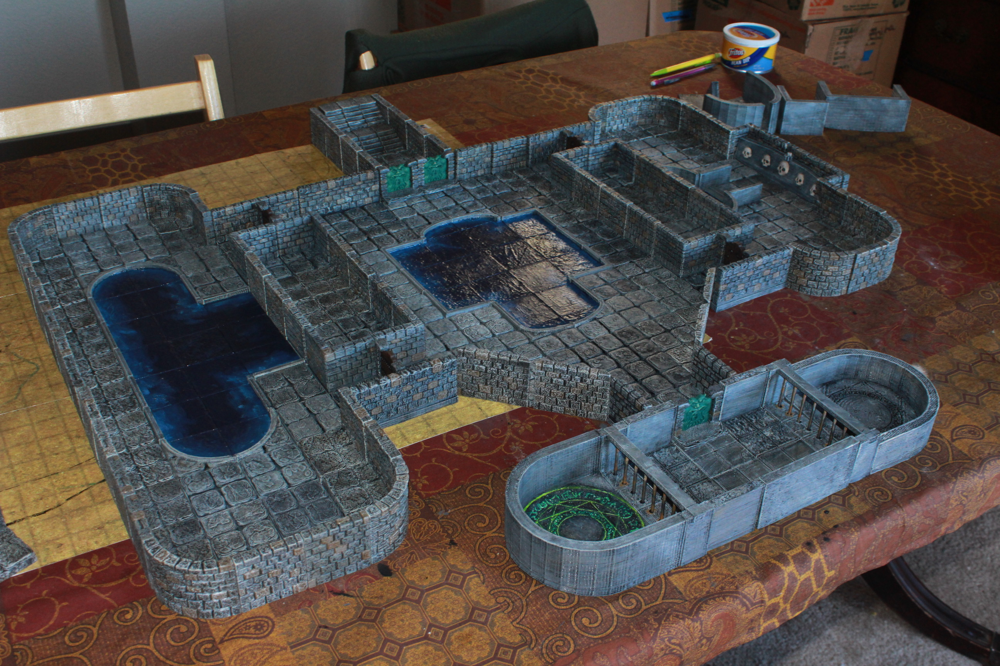
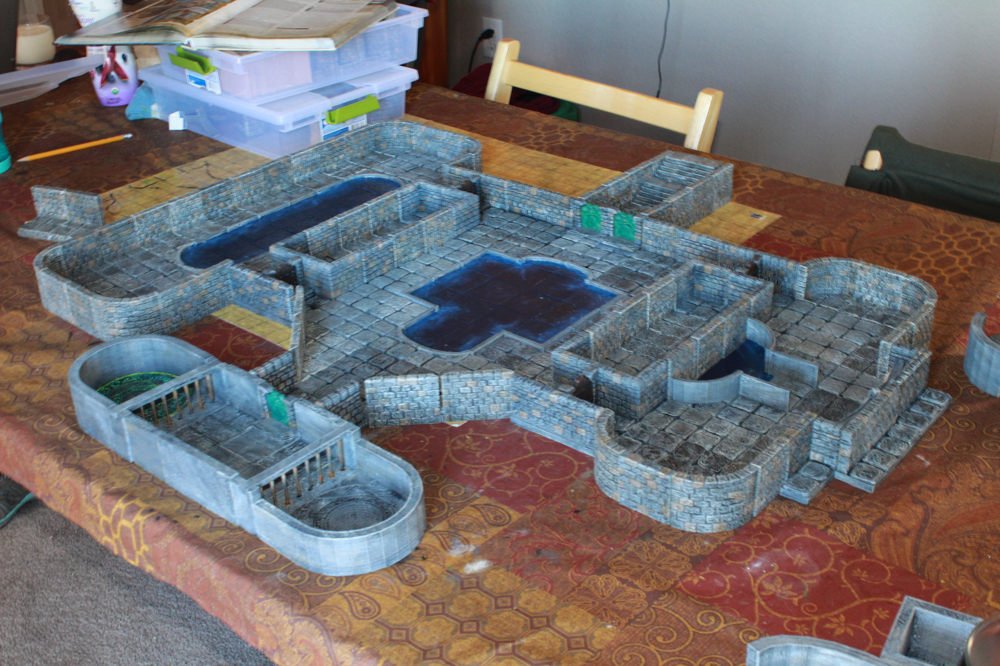
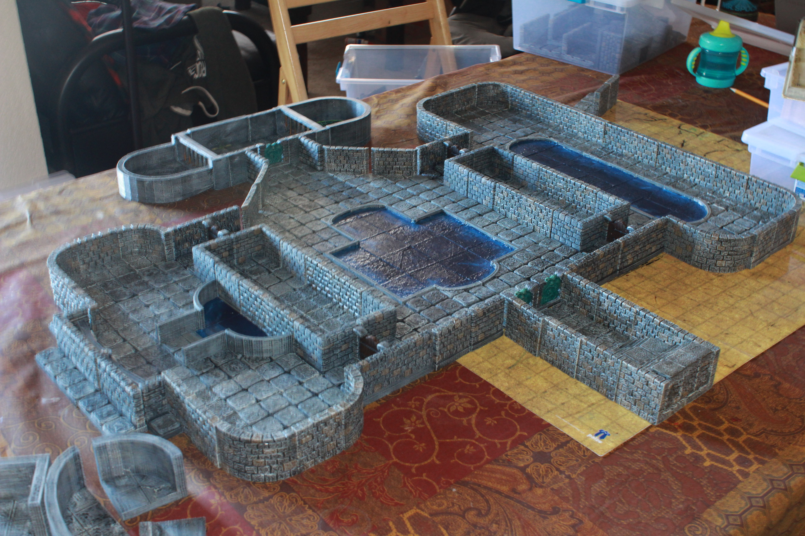
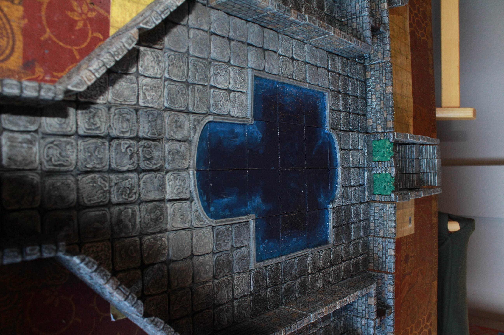
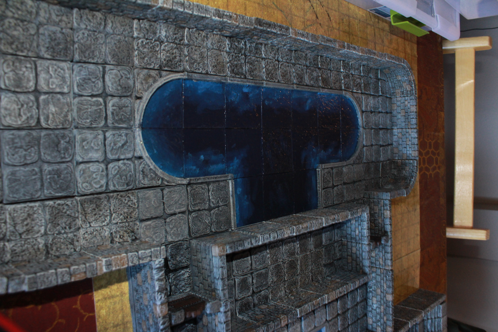
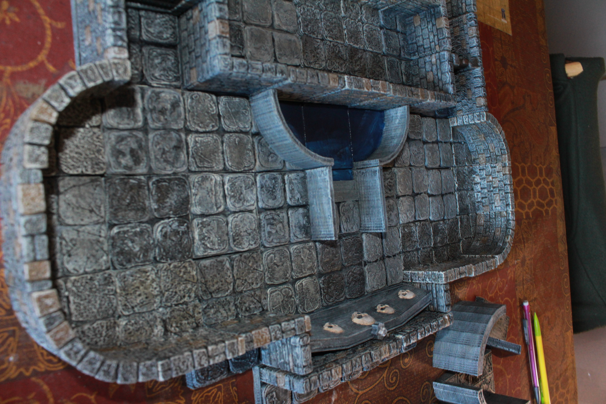
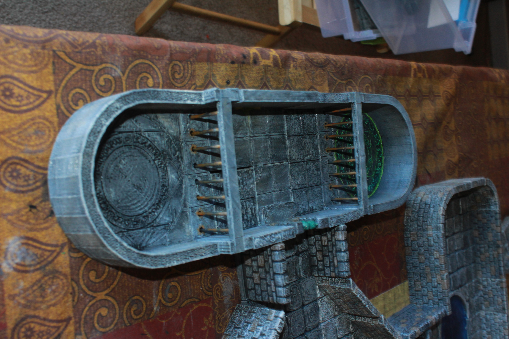

Skull's Crossing
==============

This contains a set of tiles designed to fill holes needed to receate "Skull's Crossing" from [Rise of the Runelords 3: Hook Mountain Massacre](http://paizo.com/pathfinder/adventurePath/riseOfTheRunelords).

These tiles are designed to be compatible with Dwarven Forge dungeon tiles.

Complete Floor
--------------

Custom Tiles
------------

[Cell Walls](cell_wall)
[Magic Circle](magic_circle)
[Low Wall Pool](low_wall_pool)
[Skull Crossing Model](skull_crossing_model)

Other Tiles
-----------

This model uses the following OpenForge tiles:

* [OpenForge Stone Corner](../../../stone/corner)
* [OpenForge Stone Floor Tile](../../../stone/floor_tile)
* [OpenForge Stone Wall](../../../stone/wall)
* [OpenForge Stone and Concrete Pool](../../../stone/pool)
* [OpenForge Stone Edge Wall](../../../stone/edge_wall)
* [OpenForge Edge Wall Buffer](../../../edge_buffer)

Dwarven Forge
-------------

This model uses many tiles from Dwarven Forge that there is no Openforge equivelent for.  Specifically it uses:
* [Diagonal Stone Walls](http://www.dwarvenforge.com/unpainted-add-on-packs?page=shop.product_details&flypage=flypage.pbv.v1.tpl&product_id=16478&category_id=17)
* [Curved Stone Walls](http://www.dwarvenforge.com/unpainted-add-on-packs?page=shop.product_details&flypage=flypage.pbv.v1.tpl&product_id=16479&category_id=17)
* [Wooden and Dwarven Doors](http://www.dwarvenforge.com/unpainted-add-on-packs?page=shop.product_details&flypage=flypage.pbv.v1.tpl&product_id=16483&category_id=17)
* [Stone Staircases](http://www.dwarvenforge.com/unpainted-add-on-packs?page=shop.product_details&flypage=flypage.pbv.v1.tpl&product_id=16482&category_id=17)

Also in use are multiple Dwarven Forge tiles for cases where I do not have enough printed tiles.  Specifically Stone Walls from the [Game Tiles Set](http://www.dwarvenforge.com/unpainted-sets?page=shop.product_details&flypage=flypage.pbv.v1.tpl&product_id=16475&category_id=16).

Dwarven Forge's product is fantastic, please consider supporting them with purchases.
