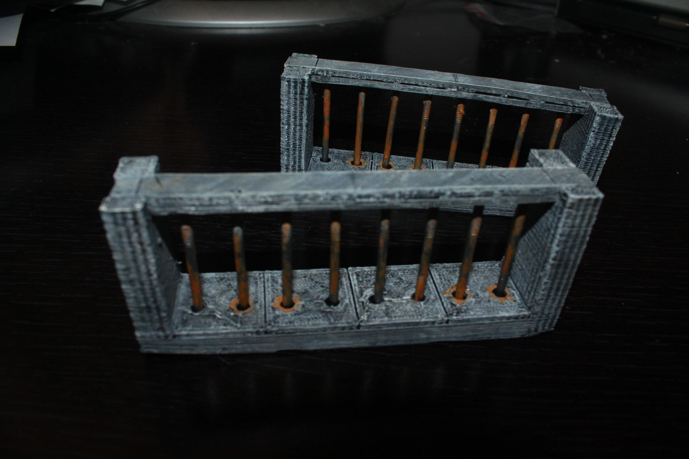

Cell Walls
==========

This contains a set of Cell wall tiles.  They were initially designed for my running of [Rise of the Runelords 3: Hook Mountain Massacre](http://paizo.com/pathfinder/adventurePath/riseOfTheRunelords).  This set is designed to use 6 penny 1 3/4" nails as the cell bars.  Paint has been applied to make it appear to be rusted.

The cell wall tiles are designed to be compatible with Dwarven Forge dungeon tiles.

Cell Walls
----------

* 1x1: [Top Strip](cell_bar_strip_top_1x1.stl), [Bottom Strip](cell_bar_strip_bottom_1x1.stl), [Wall](edge_cell_wall_1x1.stl)
* 1x2: [Top Strip](cell_bar_strip_top_1x2.stl), [Bottom Strip](cell_bar_strip_bottom_1x2.stl), [Wall](edge_cell_wall_1x2.stl)
* 1x3: [Top Strip](cell_bar_strip_top_1x3.stl), [Bottom Strip](cell_bar_strip_bottom_1x3.stl), [Wall](edge_cell_wall_1x3.stl)
* 1x4: [Top Strip](cell_bar_strip_top_1x4.stl), [Bottom Strip](cell_bar_strip_bottom_1x4.stl), [Wall](edge_cell_wall_1x4.stl)

You can find this set on [thingivese](http://www.thingiverse.com/thing:)

