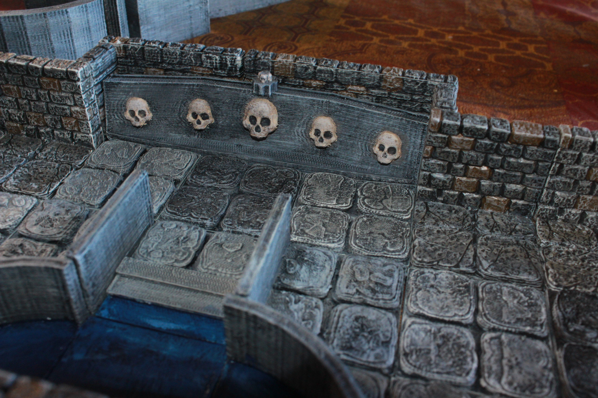

Low Wall Pool
=============

This is a small set of low wall pieces for a pool in Grazuul's Domain at Skull's Crossing in [Rise of the Runelords 3: Hook Mountain Massacre](http://paizo.com/pathfinder/adventurePath/riseOfTheRunelords).

Dungeon wall tiles designed to be compatible with Dwarven Forge dungeon tiles.

Tiles
-----

There are currently only two pieces here.  In the future I may make more low wall pieces if there is acall for it.

* [Low Wall Curved Pool](low_wall_pool_curved_tile.stl)
* [Low Wall](low_wall.stl)

You can find this set on [thingivese](http://www.thingiverse.com/thing:178621)

