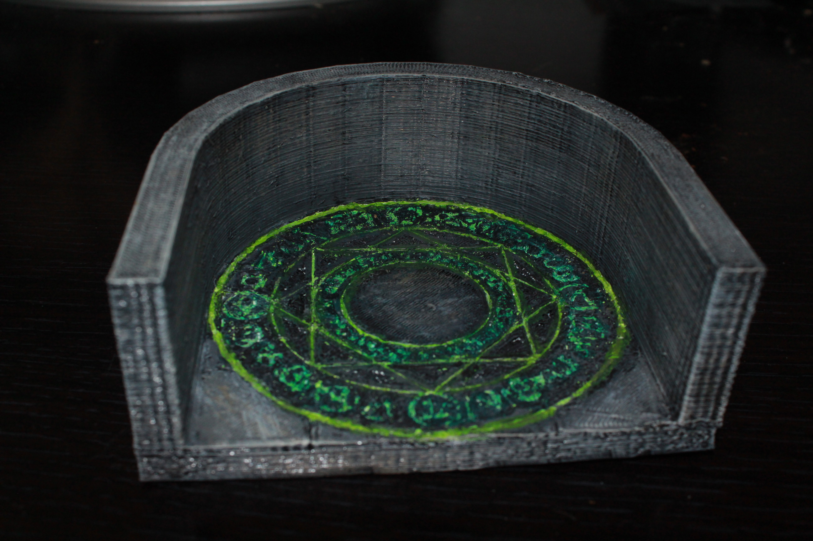

Magic Circles
=============

This contains a set of magic circles with and without walls.  These are designed to be the magic circles imprisoning the pwer source for the dam "Skull's Crossing" in [Rise of the Runelords 3: Hook Mountain Massacre](http://paizo.com/pathfinder/adventurePath/riseOfTheRunelords).

These magic circles are broadly useful for a number of other circumstances.

These tiles are designed to be compatible with Dwarven Forge dungeon tiles.

The magic circle used is derived from [this](http://img.photobucket.com/albums/v11/USSKenji64296/MidhildaMagicCircle.jpg).

Magic Circle
------------

These are hard to print pieces, as there is a lot of detail.  Be prepared to use a knife and a lot of care in painting these, but the results are pretty awesome.

* [Magic Circle Floor 1 (complicated)](circle_floor_1.stl)
* [Walled Magic Circle 1 (complicated)](walled_magic_circle_1.stl)
* [Magic Circle Floor 2 (simplified)](circle_floor_2.stl)
* [Walled Magic Circle 2 (simplified)](walled_magic_circle_2.stl)

You can find this set on [thingivese](http://www.thingiverse.com/thing:178621)

