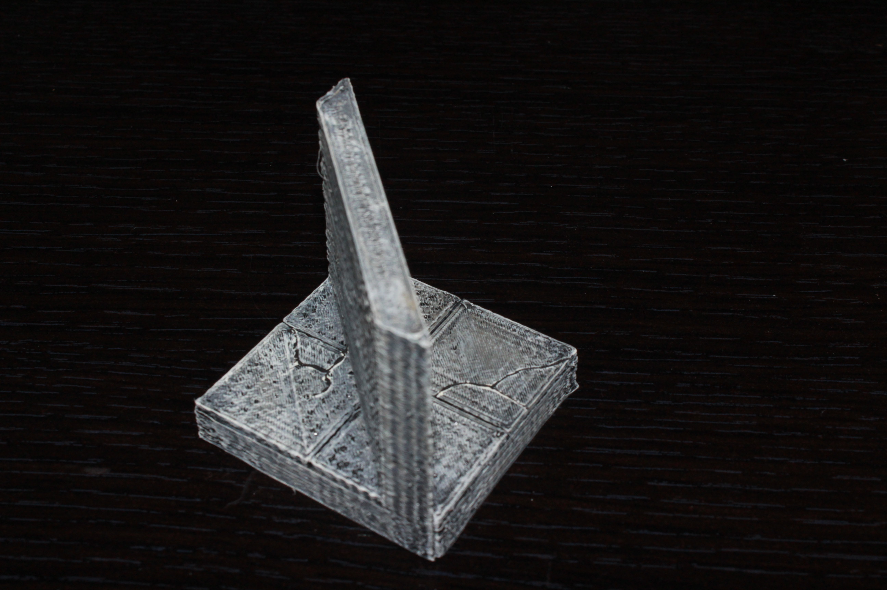
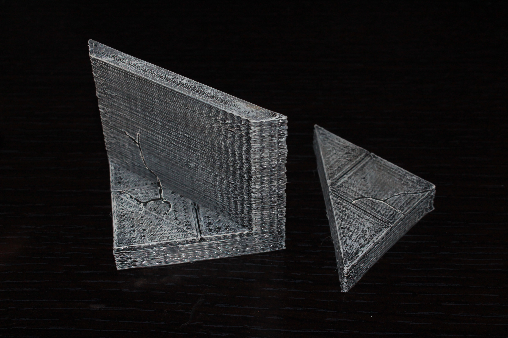

Diagonal tiles
============

Dungeon diagonal tiles designed to be compatible with Dwarven Forge dungeon tiles.

I've created the smooth set as a way of designing the basic form of the tiles that I intend for all other sets.  These tiles can be used as concrete, ice, dirt, or painted to really be any type of tile, as they have no printed decoration.

Smooth
------

Currently there are 4 smooth diagonal tiles and 4 smooth diagonal half floor tiles in equal size from 1x1 to 4x4.

* [1x1 Diagonal](smooth_diagonal_1x1.stl)
* [2x2 Diagonal](smooth_diagonal_2x2.stl)
* [3x3 Diagonal](smooth_diagonal_3x3.stl)
* [4x4 Diagonal](smooth_diagonal_4x4.stl)

* [1x1 Diagonal Half Floor](smooth_diagonal_half_floor_1x1.stl)
* [2x2 Diagonal Half Floor](smooth_diagonal_half_floor_2x2.stl)
* [3x3 Diagonal Half Floor](smooth_diagonal_half_floor_3x3.stl)
* [4x4 Diagonal Half Floor](smooth_diagonal_half_floor_4x4.stl)

You can find this set on [thingivese](http://www.thingiverse.com/thing:242011)

