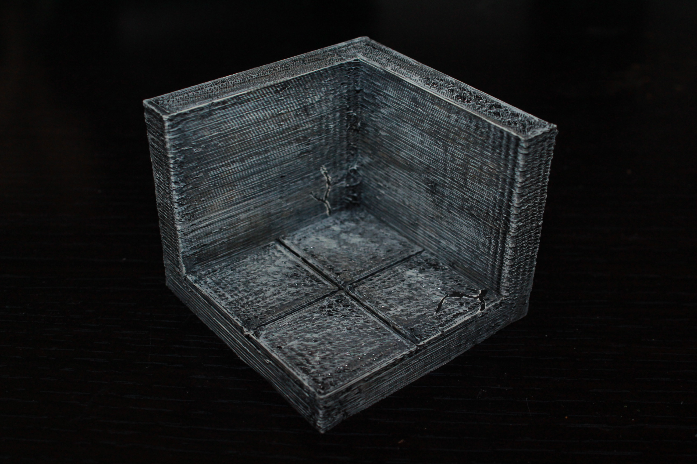

Corner tiles
============

Dungeon edge corner tiles designed to be compatible with Dwarven Forge dungeon tiles.

I've created the concrete set as a way of designing the basic form of the tiles that I intend for all other sets.  These tiles can be used as concrete, or painted to really be any type of tile, as they have no printed decoration.

Concrete
--------

Currently there are 4 concrete/plain edge corner tiles in equal size from 1x1 to 4x4.

* [1x1 Corner](concrete_edge_corner_1x1.stl)
* [2x2 Corner](concrete_edge_corner_2x2.stl)
* [3x3 Corner](concrete_edge_corner_3x3.stl)
* [4x4 Corner](concrete_edge_corner_4x4.stl)

You can find this set on [thingivese](http://www.thingiverse.com/thing:234759)

