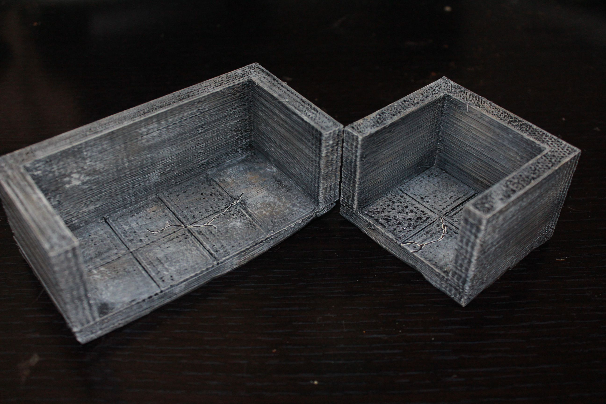

Dead end tiles
==============

Dungeon edge dead end tiles designed to be compatible with Dwarven Forge dungeon tiles.

I've created the concrete set as a way of designing the basic form of the tiles that I intend for all other sets.  These tiles can be used as concrete, or painted to really be any type of tile, as they have no printed decoration.

Concrete
--------

Currently there are 16 concrete/plain edge dead ends tiles in every size from 1x1 to 4x4.

<table>
<tr><td><a href="concrete_edge_dead_end_1x1.stl">1x1</a></td><td><a href="concrete_edge_dead_end_1x2.stl">1x2</a></td><td><a href="concrete_edge_dead_end_1x3.stl">1x3</a></td><td><a href="concrete_edge_dead_end_1x4.stl">1x4</a></td></tr>
<tr><td><a href="concrete_edge_dead_end_2x1.stl">2x1</a></td><td><a href="concrete_edge_dead_end_2x2.stl">2x2</a></td><td><a href="concrete_edge_dead_end_2x3.stl">2x3</a></td><td><a href="concrete_edge_dead_end_2x4.stl">2x4</a></td></tr>
<tr><td><a href="concrete_edge_dead_end_3x1.stl">3x1</a></td><td><a href="concrete_edge_dead_end_3x2.stl">3x2</a></td><td><a href="concrete_edge_dead_end_3x3.stl">3x3</a></td><td><a href="concrete_edge_dead_end_3x4.stl">3x4</a></td></tr>
<tr><td><a href="concrete_edge_dead_end_4x1.stl">4x1</a></td><td><a href="concrete_edge_dead_end_4x2.stl">4x2</a></td><td><a href="concrete_edge_dead_end_4x3.stl">4x3</a></td><td><a href="concrete_edge_dead_end_4x4.stl">4x4</a></td></tr>
</table>

You can find this set on [thingivese](http://www.thingiverse.com/thing:)

