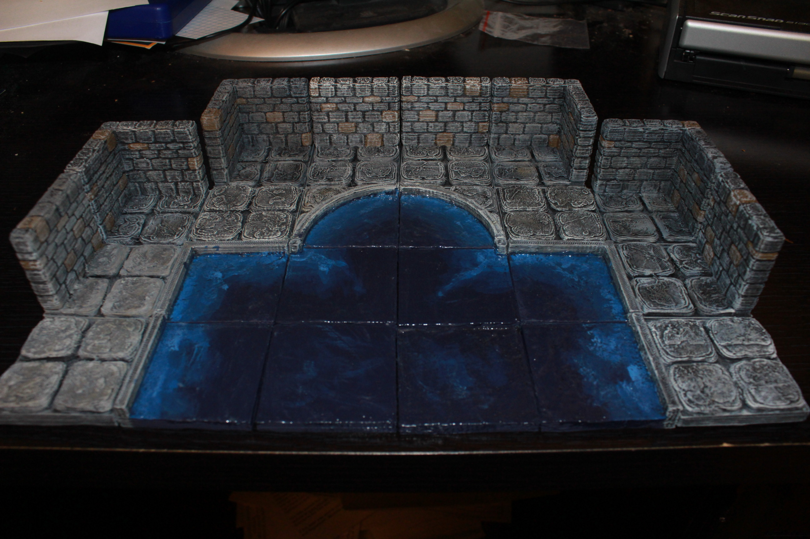
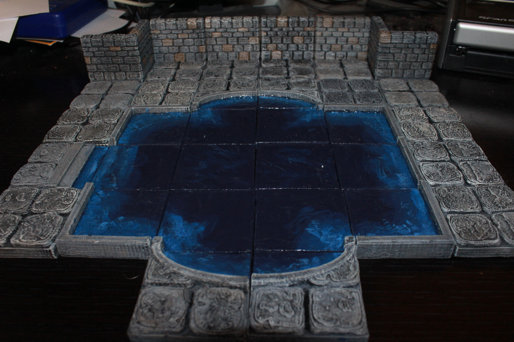

Floor tiles
===========

Dungeon floor tiles designed to be compatible with Dwarven Forge dungeon tiles.

Stone and Concrete Pool
-----------------------

This set has pool tiles with a variety of edges to create pools of water, lava, magic goo, whatever.

* [Water tile](pool.stl)
* [Straight Pool Edge](pool_straight.stl)
* [Half tile Straight Pool Edge](pool_half_straight.stl)
* [Corner Pool Edge](pool_corner.stl)
* [Half tile Corner (Left) Pool Edge](pool_half_corner_left.stl)
* [Half tile Corner (right) Pool Edge](pool_half_corner_right.stl)
* [Quarter tile Corner Pool Edge](pool_quarter_corner.stl)
* [Curved Pool Edge](pool_curved.stl)
* [Half tile Curved (left) Pool Edge](pool_half_curved_left.stl)
* [Half tile Curved (right) Pool Edge](pool_half_curved_right.stl)
* [Quarter tile Curved Pool Edge](pool_quarter_curved.stl)
* [Diagonal Pool Edge](pool_half_diagonal.stl)
* [Quarter tile Pool Edge](pool_quarter_diagonal.stl)
* [Three quarters tile Pool Edge](pool_three_quarter_diagonal.stl)
* [Corner nub Pool Edge](pool_corner_nub.stl) (really a paint guide to differentiate between a water tile and a water tile that butts against an inner corner
* [Corner nub (2 nubs) Pool Edge](pool_corner_nub_2.stl) (same as above, but a nub on 2 corners sharing a side)
* [Pool Stairs](pool_stairs.stl)

You can find this set on [thingivese](http://www.thingiverse.com/thing:224639)
