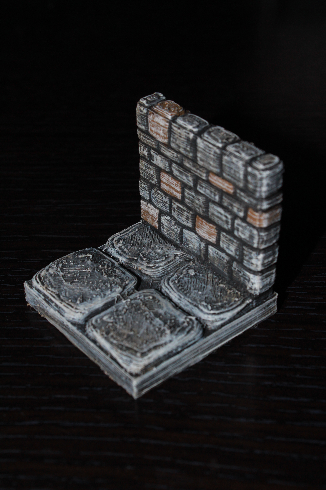
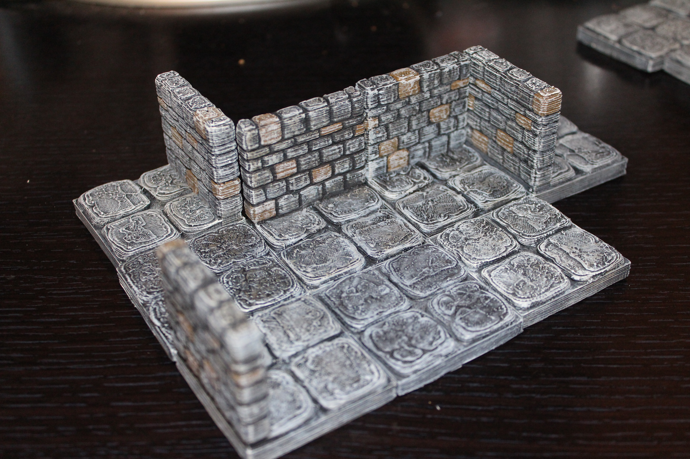

Wall tiles
===========

Dungeon wall tiles designed to be compatible with Dwarven Forge dungeon tiles.

Stone
-----

Currently there are 16 stone wall tiles in every size from 1x1 to 4x4.

<table>
<tr><td><a href="wall_1x1.stl">1x1</a></td><td><a href="wall_1x2.stl">1x2</a></td><td><a href="wall_1x3.stl">1x3</a></td><td><a href="wall_1x4.stl">1x4</a></td></tr>
<tr><td><a href="wall_2x1.stl">2x1</a></td><td><a href="wall_2x2.stl">2x2</a></td><td><a href="wall_2x3.stl">2x3</a></td><td><a href="wall_2x4.stl">2x4</a></td></tr>
<tr><td><a href="wall_3x1.stl">3x1</a></td><td><a href="wall_3x2.stl">3x2</a></td><td><a href="wall_3x3.stl">3x3</a></td><td><a href="wall_3x4.stl">3x4</a></td></tr>
<tr><td><a href="wall_4x1.stl">4x1</a></td><td><a href="wall_4x2.stl">4x2</a></td><td><a href="wall_4x3.stl">4x3</a></td><td><a href="wall_4x4.stl">4x4</a></td></tr>
</table>

You can find this set on [thingivese](http://www.thingiverse.com/thing:178621)

Updates
-------

* 1.0.1 : Added more walls for every combination between 1x1 - 4x4
